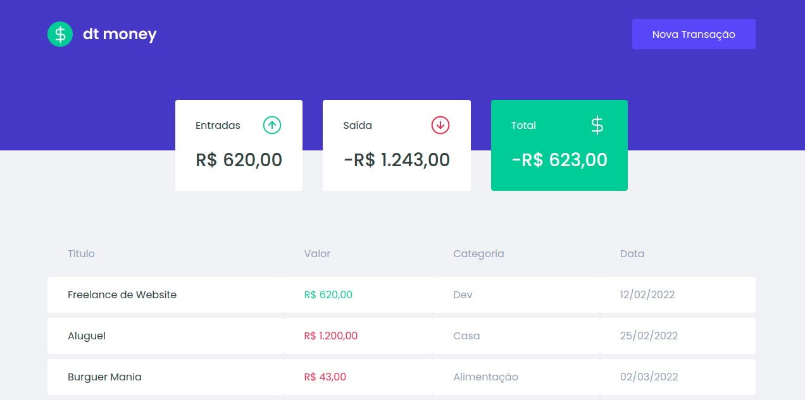

<h1 align="center">💸 DT Money</h1>



> 🔎 DT Money website made in Rocketseat course

## :page_facing_up: Explanation

The site is called DT Money and it manages to record fictitious transactions. It taught and implemented the concept of FAKE API, functionalities with styled components, use of context and hooks.

## 🎯 Steps

:heavy_check_mark: Header component\
:heavy_check_mark: Dashboard component\
:heavy_check_mark: Component Summary\
:heavy_check_mark: Transaction Table component\
:heavy_check_mark: Consuming API with MirageJS\
:heavy_check_mark: New Transaction Modal Component\
:heavy_check_mark: Modal Button Features\
:heavy_check_mark: Saving Form Data\
:heavy_check_mark: Transaction in API\
:heavy_check_mark: Listing Transaction and Seeds\
:heavy_check_mark: Formatting Values\
:heavy_check_mark: Context API\
:heavy_check_mark: Loading Transactions with Context\
:heavy_check_mark: Insert Context\
:heavy_check_mark: Summary Summary\
:heavy_check_mark: Creating a Hook\
:heavy_check_mark: Finished Project

## 🚀 Technologies

- [ReactJs](https://pt-br.reactjs.org/docs/getting-started.html)
- [TypeScript](https://www.typescriptlang.org/docs/)
- [Styled Components](https://styled-components.com/)
- [Polished](https://polished.js.org/docs/)
- [Axios](https://axios-http.com/ptbr/docs/intro)

## 📡 API'𝘀 used in the application

- 🐪 [MirageJs](https://miragejs.com/docs/getting-started/introduction/)

## :closed_book: How to use it?

Before starting, you need to have [Git](https://git-scm.com) and [Node](https://nodejs.org/en/) installed.

```bash
# Clone this project
$ git clone YOUR REPOSITORY LINK
# access
$ cd YOUR FOLDER NAME
# install dependencies
$ yarn or npm
# Run the project
$ yarn start or npm start
# The server will initialize in the <http://localhost:3000>
```

## 🤝 Collaborators

Thanks to the following people who contributed to this project:

<table>
  <tr>
    <td align="center">
      <a href="#">
        <br>
        <sub>
          <b>Kayke Fujinaka</b>
        </sub>
      </a>
    </all>
  </tr>
</table>

&#xa0;

<a href="#top">Go back to top</a>
